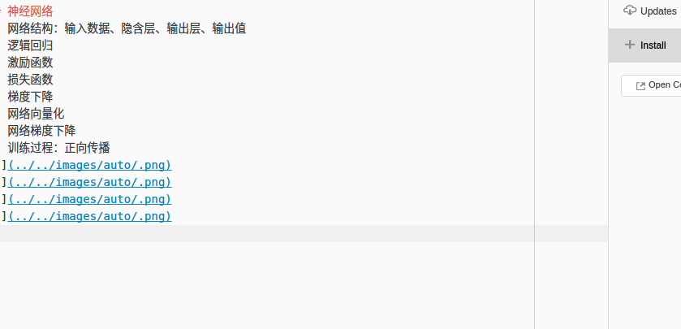

# 机器学习笔记
## 应用（_通过数据自动实现以下规则_）
1. 商品推荐：关联规则（啤酒纸尿裤）、协同过滤
1. 聚类：运营商套餐
1. 垃圾邮件识别：使用朴素贝叶斯算法
1. 偿贷能力识别：决策树
1. 百度搜索广告：ctr预估（_预测用户可能点击的选项概率，并进行排序显示_）
1. 自然语言处理：情感分析、实体识别
1. 图像识别、人脸识别
1. 自动驾驶

## 神经网络
1. 网络结构：输入数据、隐含层、输出层、输出值
1. 逻辑回归
1. 激励函数
1. 损失函数
1. 梯度下降
1. 网络向量化
1. 网络梯度下降
1. 训练过程：正向传播

